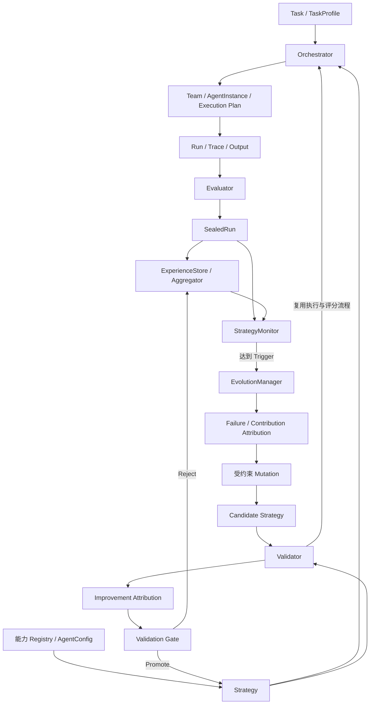
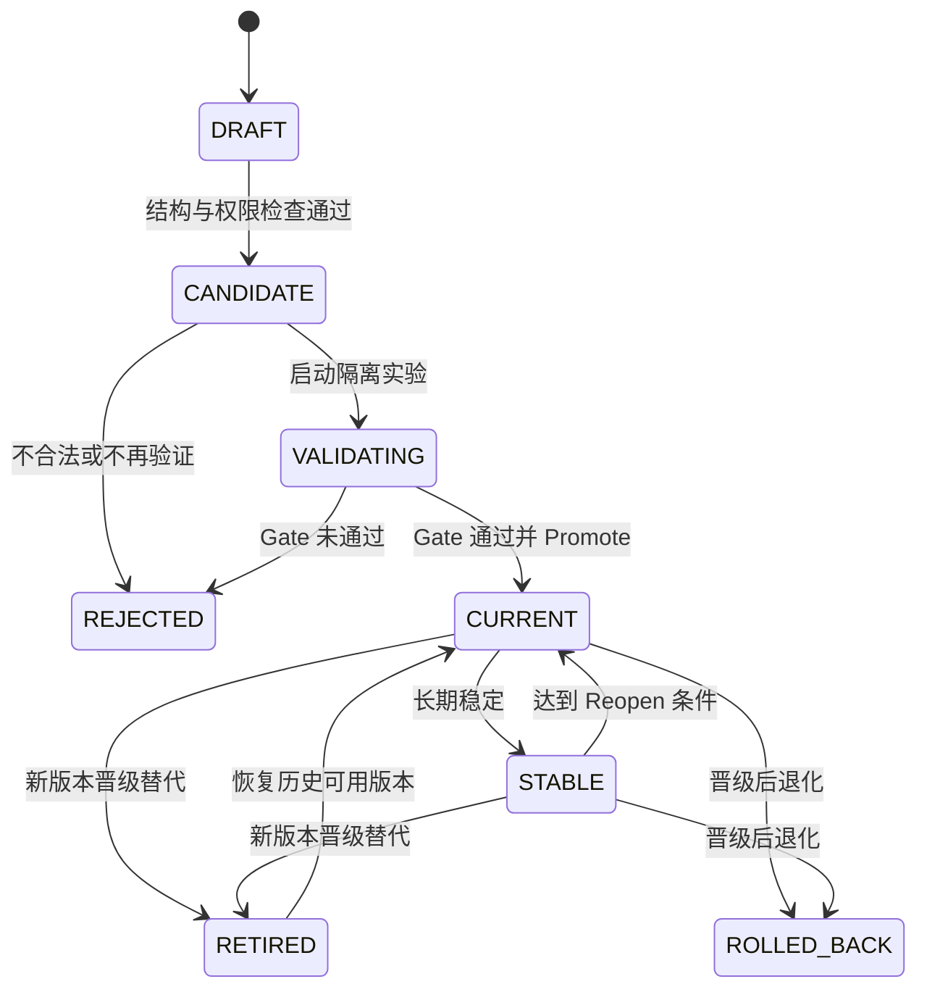

# EvoTeam 架构基线

本文件定义最终讨论确定的领域概念、模块职责与执行边界。六层是概念视图，两个闭环是时间视图；两者都不要求拆成六个服务。代码实现遵循这套基线，数值阈值按实验协议校准。

## 1. 六层概念模型

| 层 | 对象与模块 | 职责 |
| --- | --- | --- |
| ① 输入与任务 | Task、TaskProfile | 描述目标、能力需求、约束、风险与预算 |
| ② 基础能力与 Agent 定义 | Role / Prompt / Skill / Tool / Model Registry、AgentConfig | 登记可用能力并组成稳定配置 |
| ③ 核心组织策略 | StrategyDefinition、StrategyVersionMetadata | 定义 Agent 组合、拓扑、调度及版本身份 |
| ④ 在线运行时 | Orchestrator、Team、AgentInstance、Execution Plan、Run | 实例化与执行；Critic / Verifier 在 Team 内工作 |
| ⑤ 观察评价与经验 | Trace、Evaluator、Metrics、SealedRun、ExperienceStore / Aggregator、StrategyMonitor | 单次评分、封存、跨 Run 聚合与触发检测 |
| ⑥ 离线演进治理 | EvolutionManager、Attribution、Mutation、Candidate 生命周期、Validator、Validation Gate | 组织修改、比较实验、晋级、拒绝、稳定、重开与回滚 |



图中的 Validator 回调 Orchestrator 代表隔离实验运行；这些 Run 不进入线上 Monitor 的正常任务窗口，也不触发嵌套演进。

## 2. 核心术语与数据边界

| 名称 | 定义 | 保存与变化方式 |
| --- | --- | --- |
| RoleDefinition | 稳定职责原型 | 固定 Role Pool，自动演进不能修改 |
| AgentConfig | 一个 Agent 的稳定配置 | 引用 Role、Prompt、Skill、Tool Policy、Model 与 Runtime Config，带版本保存 |
| AgentInstance | AgentConfig 在一次 Run 中的具体执行对象 | 持有 Task、Context、Messages、Tool Results、State；Run-scoped |
| Strategy | 可执行组织方案及版本身份 | 核心演进对象；Current、Candidate 使用同一结构 |
| Team | 当前任务实际启用的 AgentInstance 集合及协作关系 | 随 Run 创建和封存 |
| Execution Plan / Workflow | Strategy 在当前任务中解析出的执行安排与路径 | 属于本次运行，不等同于长期 Strategy |
| Run | Team 按固定 Strategy 快照执行一次 Task | 包含执行状态、结果、Trace 与用量 |
| SealedRun | Run 与评价结果的不可修改历史记录 | 支持审计、聚合、回放分析 |
| Experience | 从历史证据提炼的有适用范围的经验数据 | 包含支持样本、反例、置信度与验证历史 |
| EvolutionRecord | 一次演进的治理记录 | 保存 Trigger、证据、归因、Mutation、Candidate、Validation、Decision、Rollback Target |

现行名称统一为 **AgentConfig**；早期讨论中的 AgentSpec 不再作为另一套并列概念。Team 不是 Role 列表，Strategy 不保存运行中的 SDK Agent 对象。Candidate 只是 Strategy 的生命周期状态，不单独定义另一种组织模型。

## 3. 稳定配置的组成

```text
Strategy
├── StrategyDefinition
│   ├── AgentConfig[]
│   │   ├── config_id / config_version
│   │   ├── role_ref
│   │   ├── prompt_ref
│   │   ├── skill_refs
│   │   ├── tool_policy
│   │   ├── model_ref
│   │   └── runtime_config
│   ├── Topology
│   └── OrchestrationPolicy
└── StrategyVersionMetadata
    ├── strategy_id / version
    ├── parent_version / generation
    └── lifecycle_status
```

这是领域契约；`evoteam/domain/` 已提供 Pydantic 模型。项目规划 v1 已提供具体输入、计划、分析和审查 Schema。执行器检查节点、连边、Prompt 引用、运行上限和不支持能力；当前只开放固定 v0、可选唯一 Verifier 分支和一次有界返工，任意候选图、模型/Tool 注册与权限验证仍待实现。具体单位和运行路径见 [系统运行指南](SYSTEM_WALKTHROUGH.md)。Task 和消息沿用 JSON 信封，规划产物按固定 Schema 解析。

Topology 描述有向节点与信息流；OrchestrationPolicy 描述顺序、并行、条件、Retry、Replan、Routing 和 Stop 规则。表达能力可以逐步实现，未实现的结构应明确拒绝，不得静默降级或交给 LLM 自由执行。

Role Pool 固定为 Planner、Executor、Researcher、Analyst、Writer、Verifier、Critic。专业化使用同一 Role 下的不同 AgentConfig，不自动扩展职责类型。

| Prompt 层次 | 所属对象 | 是否自动演进 |
| --- | --- | --- |
| Role responsibility | RoleDefinition 的稳定职责说明 | 否 |
| System Prompt / Instruction Template | AgentConfig 的版本化 prompt_ref | 是，作为受约束 Strategy Mutation |
| Task / User Input | 当前任务数据 | 否 |
| 上游输出、消息、Tool Result、临时状态 | AgentInstance Runtime Context | 否，不直接写回稳定配置 |

## 4. 在线执行闭环

1. 接收 Task，形成结构化 TaskProfile。
2. 获取当前服务版本；CURRENT 与 STABLE 都可以服务任务。一次 Run 固定使用开始时的 Strategy 快照。
3. Orchestrator 按 Strategy 解析启用节点与路径，通过 Runtime 创建 AgentInstance，组成 Team。
4. 按 Topology 传递结构化输入，执行 Agent、允许的 Tool 与有界 Retry。Agent 不直接互调。
5. Critic / Verifier 在 Team 内检查产物，提供通过、问题或返工意见；Orchestrator 按既定策略控制是否继续。
6. Run 结束后，独立 Evaluator 生成评价和指标；封存 Output、Trace、配置身份与评价为 SealedRun。
7. ExperienceStore 保存证据，Aggregator 聚合，StrategyMonitor 更新同策略版本、同任务范围的长期统计。
8. 未达到 Trigger 时结束本轮流程，后续任务继续使用当前策略。

v0 固定为 Planner → Executor → Critic。Planner 识别目标与约束，Executor 形成项目计划，Critic 审查产物。v0 不在每个任务开始时自由选择团队，也不自动向 Planner 注入历史经验。

成功、失败、取消和超时都必须记录。若未产生完整产物，Evaluator 保留可评价部分及缺失原因，不能把失败样本静默排除。封存记录支持根据已保存事件重建过程；重新调用随机模型不等于能够逐字复现旧输出。

## 5. 组件职责与接口契约

| 组件 | 身份与时机 | 输入 → 输出 | 不承担的职责 |
| --- | --- | --- | --- |
| TaskService | 应用层在线入口；每个业务任务 | Task → 当前策略、画像、Run、评分、封存 | 不调用 Monitor / EvolutionManager |
| EvolutionService | 应用层观察与离线入口；显式调用 | 线上证据窗口 → MonitorResult → 有 Trigger 才派发 | 不替代 Monitor 的阈值判断或 Manager 的演进算法 |
| Orchestrator | 确定性在线控制器；每个任务及验证 Run | Task + Strategy → RunResult / Trace | 不打策略分、不生成 Candidate、不决定晋级 |
| Critic / Verifier | Team 内业务 Agent；任务执行中 | 产物 + Checklist / Tool Result → 结构化审查结果 | 不代替独立 Evaluator 或 Gate |
| Evaluator | 规则、程序与固定 Judge；单 Run 结束后 | Task + RunResult → EvaluationResult / Metrics | 不生成 Candidate，不裁决长期趋势 |
| ExperienceStore | 持久化组件 | SealedRun / Experience / 演进证据 → 可查询记录 | 不自行推断收益 |
| ExperienceAggregator | 跨 Run 聚合 | 兼容范围的证据 → OutcomePattern | 不把单次成功等同于改进 |
| StrategyMonitor | 统计规则；样本窗口检查 | SealedRuns + EvolutionPolicy → MonitorResult / Trigger | 不变异、不跑候选、不亲自晋级 |
| EvolutionManager | 确定性状态机；Trigger 后 | Trigger + Current + Experience → EvolutionRecord / 生命周期操作 | 不替代 Evaluator、Validator、Gate |
| Validator | 独立批量实验器；Candidate 后 | Current + Candidate + Validation Set → ValidationResult | 不调整候选或验证标准答案 |
| Validation Gate | 预注册规则；实验与改进归因后 | ValidationResult + Attribution + Gate Policy → 决策及理由 | 不生成策略，不凭 LLM 意见放行 |

LLM 可以参与局部归因解释与候选提案；触发、结构合法性、权限、预算和晋级规则由代码控制。Experience 是数据，不需要单独的 Experience Agent。

## 6. 经验与归因

Event 是细粒度观察，SealedRun 是任务级证据，Window 是跨任务分析单位。监控窗口按 Strategy 版本、任务范围和评价协议区分，避免混合不可比较的成绩。

- FailureExperience：记录何种条件下出现什么问题、支持 Run、反例、Origin / Control、置信度及适用范围。
- Contribution Pattern：记录节点、Tool 或 Edge 的贡献证据，供保留、裁剪、条件启用使用；不能仅用发言量或 Token 数替代边际贡献。
- ImprovementExperience：在比较验证后记录修改、质量/错误变化、成本变化、支持验证及适用范围。正向收益需有对照，拒绝和退化也保留为负面证据。

Failure Attribution 在候选生成前定位错误首次产生处（Origin）和本应发现却未阻断的环节（Control）。Contribution Analysis 在跨 Run 分析中识别冗余。Improvement Attribution 在 Validator 完成后、晋级前解释收益来自何项修改。

确定性校验与 Trace Provenance 优先。高影响、归因不确定或结构性候选使用反事实回放/消融补强，普通 Run 不无条件执行昂贵归因实验。证据不足时继续采样，不把猜测封存为已确认因果。

## 7. 离线演进闭环

1. Monitor 产生带窗口证据与 Policy 版本的 Trigger。
2. EvolutionManager 固定当前父版本，组织 Failure / Contribution Attribution。
3. 根据归因选择最小修改目标，生成数量与预算受限的提案。
4. 检查 Schema、引用、权限、拓扑与运行上限，形成隔离 Candidate Strategy。
5. Validator 在同一验证集上调用同一个 Orchestrator + Evaluator，运行 Current 与 Candidate。
6. 汇总比较、检查跨子类表现，完成 Improvement Attribution。
7. Gate 按预注册规则决定 PASS、FAIL、继续采样或收窄范围。
8. 通过后由 EvolutionManager 执行 Promote；否则 Reject 或保留待补充证据状态。所有过程保存 EvolutionRecord。
9. 晋级只影响后续任务；稳定后关闭主动搜索，异常达到阈值才 Reopen，退化按规则 Rollback。

收窄适用范围会改变 Candidate 的行为，必须作为明确的候选修改重新验证，不能把全局验证失败直接转成未经验证的条件策略上线。当前不因此引入持久化 Family 分支。

### Mutation 白名单

| 操作 | 对象与边界 |
| --- | --- |
| ADD_AGENT_CONFIG | 从已有 Role 构造配置并加入节点，补齐必要连接，检查节点及预算上限 |
| REMOVE_AGENT_CONFIG | 删除低贡献配置及相关连接，确保图合法并验证质量不退化 |
| REPLACE_AGENT_CONFIG | 替换为引用已登记能力的配置，保留原版本与差异 |
| UPDATE_PROMPT | 更新 AgentConfig 引用的版本化模板，不改 Role 或用户输入 |
| UPDATE_TOOL_POLICY | 调整既有授权工具的使用规则，不新增能力或扩大权限 |
| REWIRE | 在支持的有向结构内修改信息流，禁止无界循环 |
| CONDITIONALIZE | 使用可观测 TaskProfile 条件启用节点、边或工具 |

一个候选尽量只改变一个核心因素；新增 Verifier 及必要连边属于同一个可解释结构修改。Runtime 调度能力的存在不等于开放所有调度参数的自动搜索。

## 8. 生命周期



状态描述版本的治理状态。当前服务指向一个 CURRENT 或 STABLE 版本；Reopen 时旧版本仍服务，新的 Candidate 在隔离环境验证。候选数量可以大于一，但当前仅维护一条正式晋级谱系。

Reject 是拒绝尚未上线的候选；Rollback 是将已上线退化版本撤下并恢复可用历史版本。恢复目标与原因写入 EvolutionRecord。封存 StrategyDefinition 不因状态改变而被重写，生命周期变更另有审计。

版本标识需要唯一，多个 Candidate 不能简单地各自使用 `parent.version + 1` 覆盖彼此。version 标识快照，parent_version 关联来源，generation 记录演进代次；不能把原始讨论中的 v1/v2/v3 文档版本当作运行时 Strategy 版本。

## 9. Runtime 与代码组织

```text
Application / API / Console
          ↓
EvoTeam Domain + Orchestration + Evaluation + Experience + Monitoring + Evolution
          ↓
RuntimeProtocol
          ↓
OpenJiuwenRuntimeAdapter
          ↓
openJiuwen Core → Model / Tool / Workflow / ReAct
```

EvoTeam 保存可序列化配置、运行证据和版本治理。Adapter 的目标职责是把 AgentConfig 映射为真实 SDK Agent，并把运行回调转换为统一 TraceEvent；Adapter 已延迟加载锁定的 ReActAgent，实现单次、无工具、无重试的结构化调用和用量转换；真实 SDK 使用本地 HTTP 完成联调，外部服务仍待实际配置验收。使用底层 Workflow 能力不能把 EvoTeam 的权限、预算与控制职责绕过。

模块布局（v0 在线闭环、受限 Verifier DAG/返工、真实 SDK、重复失败观察及多候选演进已接入）：

```text
evoteam/
├── composition.py   # 无副作用装配，在线/验证共享执行器与评价器
├── application.py   # 在线 TaskService 与显式观察/离线 EvolutionService
├── domain/          # role、agent、strategy、task、run、evaluation、experience、evolution
├── runtime/         # protocol 与 openjiuwen/adapter
├── orchestration/   # orchestrator
├── evaluation/      # 单 Run 评分、指标
├── experience/      # store 契约与 aggregator
├── monitoring/      # strategy_monitor
├── evolution/       # manager、attribution、mutation、validator、gate、lifecycle
└── storage/         # 持久化实现
```

测试可以用 Fake Runtime，真实执行通过 openJiuwen Adapter。只实现这一种真实框架适配，不引入其他 Agent Framework。离线演进是与业务执行隔离的模式，第一阶段不要求独立机器或服务部署。

## 10. 记录与持久化契约

最小记录集包括 Task / TaskProfile、版本化能力与 Strategy、Run / AgentInstance 身份、TraceEvent、EvaluationResult / Metrics、SealedRun、Experience、MonitorResult / Trigger、EvolutionRecord、ValidationResult 与生命周期记录。

TraceEvent 至少能关联 run_id、task_id、Strategy 版本、节点/实例及因果来源，并记录有序事件与时间。Agent 消息和工具调用保留输入来源、结果或产物引用，支持错误传播定位。

事件语义覆盖 Task 创建、Team 解析、Agent 开始/消息/完成/失败、Tool 调用/结果、Run 终结、评价完成、封存、Trigger、归因、候选生成、验证、Gate、晋级、拒绝、稳定、重开和回滚。具体枚举与 Schema 在 P0/P1 实现中统一定义，不维护两套同义事件。

`RunStore.seal_run(Task, RunResult, EvaluationResult)` 是应用层的封存入口：Repository 必须先保存真实快照、评价和封存索引，再返回 SealedRun。SQLite 已实现该事务及完整 Task/Strategy/Run 快照、评价与封存事件，拒绝覆盖旧记录；应用层不生成虚假的 snapshot_ref。

首轮采用单机持久化，延续 SQLite 的工程路径。Run 标记 online / validation 等运行用途，验证运行不能污染线上触发窗口。版本切换与审计要一致完成，旧定义、旧 Prompt、旧验证证据均保留。

API 与可视化读取同一套领域记录，展示 Team Graph、Timeline、失败传播、Candidate Diff、Gate 和 Strategy Timeline，不另建一套前端推断的事实。
