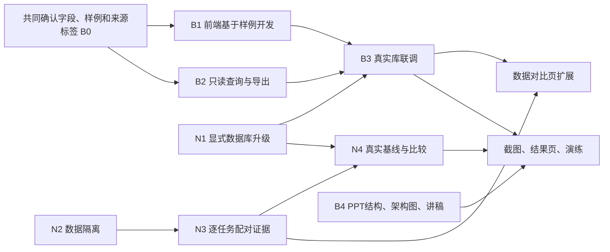

# EvoTeam 并行开发与交付计划

> 执行说明：按任务逐项使用 `superpowers:executing-plans`；每项先补失败测试，再实现和复核。以下代码和文件名是下一轮实现约定，不表示已有功能。

**目标：** 并行推进可信的核心演进能力、基于真实证据的可视化展示，以及可直接制作的 PPT。N1–N4 细化近期核心开发，B0–B4 细化展示与汇报；完整项目验收仍以 PROJECT / ROADMAP 为准。

**架构：** 沿用单条 Strategy 版本链、固定 Role Pool、openJiuwen Adapter 和独立 Evaluator。数据登记负责隔离，Validator 负责实验，Gate 负责裁决；不合并这些职责。

**技术：** Python 3.12、uv、Pydantic、SQLAlchemy / SQLite、openJiuwen Core；不增加框架或服务。

**依据：** [PROJECT](PROJECT.md)、[ARCHITECTURE](ARCHITECTURE.md)、[EXPERIMENTS](EXPERIMENTS.md)、[本轮审查](VERSION_COMPARISON.md)。长期 P0–P5 阶段定义继续以 [ROADMAP](ROADMAP.md) 为准。

## 1. 计划覆盖哪一层

| 文档 / 里程碑 | 含义 | 不代表什么 |
| --- | --- | --- |
| PROJECT + ROADMAP P0–P5 | 冻结范围内完整项目交付：核心机制、三类实验、可视化和汇报 | 不列所有未来产品化需求，不承诺生产级多租户平台 |
| 本文 N1–N4 | 最近一轮核心开发：升级、数据隔离、逐题证据和基线 | 完成四项不等于完整第一版验收 |
| 本文 B0–B4 | 与核心开发并行的展示和汇报任务 | 不能用样例页面冒充已完成的真实实验 |
| 阶段演示版 | 能演示现有主场景、证据、候选与拒绝，清楚标注未完成项 | 不降低 PROJECT 中的最终验收要求 |
| 完整项目版 | 三类任务、Prompt/Tool/结构候选、真实后续影响、治理实验和可视化达到路线图条件 | 不将 Feature Family、任意代码自改等范围外能力加入本轮 |

截至本计划更新，main 已有 CLI / 本地 FastAPI 执行入口和 SQLite 记录，没有前端工程，也没有下面拟议的 GET 查询端点。真实历史回归包含 Gate Reject；充分样本的真实晋级收益仍需验证。

## 2. 推荐的三人协作方式

暂按两位组员分别偏后端、偏前端与视觉安排；技能与截止时间尚未确认。下表是可调整的分工建议，不是对个人能力的判断。

| 人员 | 主责任 | 近期交付 | 不应承担的混合责任 |
| --- | --- | --- | --- |
| 组员 A | 核心后端、验证和治理 | N1、N2 的校验实现、N3、N4 的执行支持 | 不同时负责整套前端和 PPT 排版 |
| 组员 B | 展示链路、只读查询、前端和 PPT | B0–B4；从已有记录提取展示资料 | 不在前端重算 Gate、不直接写核心策略或数据库状态 |
| 负责人（你） | 数据/实验口径、跨模块集成和验收 | N2 数据准备、N4 协议与报告、PR 审核、讲稿与演示路线 | 不把采样规则和结果结论留给页面或模型自行决定 |

A 的核心任务较重，B 的前端加 PPT 也不是轻任务。负责人应真正承担数据整理和验收；若无法投入，必须缩减本轮演示范围或延长时间，不能靠调换名称消除工作量。

分工方案比较：

| 方案 | 适用情况 | 当前判断 |
| --- | --- | --- |
| 两人都分核心功能，最后一起做 PPT | 两人均擅长后端，离演示较远 | 核心推进快，但需提前保留展示负责人 |
| 一人核心，一人只做 PPT | 演示只剩几天、现有界面已足够 | 当前没有前端，长期使用会缺展示开发能力 |
| 一人大部分核心，一人少量核心加 PPT | 第二人不做前端、两人都能写 Python | 可让第二人做数据集/导出/PPT，别随机拆共享核心文件 |
| **一人核心，一人展示接口＋前端＋PPT** | 有前端/视觉能力，需要展示真实系统 | **默认推荐；你负责数据、实验和集成** |

## 3. 哪些依赖，哪些可以并行



PPT 骨架与架构页现在就能做；结果页等待对应证据。没有 N4 新结果时仍可用明确标注日期的历史记录完成阶段演示，不阻塞排版。B1 不等 N1–N4；B2 可用新临时库和已存在的存储读取端口开发；旧库联调等 N1。N2 与 N3 先锁字段再集成，不能两人同时改 Validator。

### 共享文件与接口交接

- A 主维护 `domain/`、`evolution/`、`orchestration/`、`monitoring/`、`storage/sqlite.py` 和写操作。N2 与 N3 的 `validator.py` 改动由 A 依次合并。
- B 主维护拟新增的 `frontend/`、`evoteam/presentation/`、`evoteam/api_queries.py`、展示测试和 `PRESENTATION_PLAN.md`。现有 `api.py` 只接一个查询 router，集成时由负责人合并。
- B 可以实现只读查询层；需要新增 Repository 方法时先提交端口和测试约定，由 A 补存储方法。展示代码不得散落 SQL 或修改生命周期。
- Schema 扩展保持旧字段，新增字段可空并注明缺失；B 的 fixture 与接口响应使用相同 Schema 版本。类型/字段有变更时同步改消费方测试。
- 分支按任务命名，如 `codex/storage-upgrade`、`codex/evidence-viewer`；每个 PR 能独立检查。每天同步接口变化和阻塞，不要求一次把所有页面与后端合并。

### B0：共同确认展示契约（拟实施，非现有 API）

**主责：B起草，A核对字段，负责人确认来源。** 开发前一次短对齐，后续兼容扩展。

- [ ] 从现有 Pydantic 模型选取字段，提交 Schema 与四类来源清晰的 fixture。
- [ ] A确认哪些字段可直接读取、哪些需要补列表端口，负责人选定本轮真实示例ID。
- [ ] B用同一Schema读取fixture，端口缺失列入B2；验收时不得要求前端自行推断缺失证据。

首先支持脱敏的静态 JSON 证据包读取；再以同一数据形状接只读 API。前端不直接读取 SQLite。包来源固定为 `fixture` / `recorded_model_run` / `current_database`；`fixture` 必须始终显示“开发样例”。来自历史模型的导出包仍标记“历史实测”，并注明不代表当前修复版本重跑结果。

| 拟议只读端点 | 所需来源 | 最低字段与行为 |
| --- | --- | --- |
| `GET /v1/runs?strategy_id=&purpose=&limit=&cursor=` | 新增分页 RunStore 查询 | items: SealedRun[]、next_cursor；线上与验证用途显式区分 |
| `GET /v1/runs/{run_id}` | read_snapshot + 封存索引 | Task、Strategy、Run、Evaluation；没有完整快照时明确 unavailable，不从索引补造产物 |
| `GET /v1/runs/{run_id}/events` | events_for_run | 按 sequence 返回事件、caused_by 与 node/instance 身份 |
| `GET /v1/strategies/{strategy_id}/versions` | 新增 StrategyStore 列表 | Strategy[] 与当前 serving ref；状态变化只呈现已有审计，不推测发生时间 |
| `GET /v1/evolutions?strategy_id=&limit=&cursor=` | 新增 EvolutionStore 列表 | EvolutionRecord 摘要、next_cursor；点击后读取详细记录 |
| `GET /v1/evolutions/{evolution_id}` | record / proposal / attribution / validation 各读取端口 | 成套证据及 missing_refs；缺失某项显示缺失，不生成假的 Gate 或 Validation |

共用展示外层为 `schema_version`、`source_kind`、`captured_at`、`code_commit`（未知可空）、`data`、`missing_refs`。列表明确筛选范围与分母，空值不转零；仅需导出的字段脱敏，不包含密钥、完整模型连接配置、系统路径或原始 SDK 日志。重放是本地浏览旧事件，不会调用 run/evolve，不宣传为实时流式执行。

## N1：给已有数据库提供显式升级入口

**文件：** 新建 `evoteam/storage/migrations.py`、`tests/test_migrations.py`；修改 `evoteam/cli.py`、`evoteam/storage/sqlite.py`、`DEVELOPMENT.md`。

**接口约定：** `upgrade_database(database: Path, *, backup: Path) -> None`；CLI 为 `python -m evoteam migrate --database <已有库> --backup <新备份路径>`。只针对已识别的六表基础版本、组员十一表版本和当前十二表版本；未知布局拒绝。

- [ ] 写回归测试：使用旧表布局创建库并保存固定策略、事件和封存记录；升级后原记录逐字段不变，新增表可用；二次升级不改证据。
- [ ] 覆盖错误路径：备份路径已存在、数据库缺失、未知列结构、备份失败时不得执行迁移；失败不能留下半升级状态。
- [ ] 执行 `uv run pytest tests/test_migrations.py -q`，确认新行为尚未实现导致失败。
- [ ] 使用 SQLite backup API 生成一致备份，显式识别布局，事务补齐缺失表并保存 Schema 版本；不得重建或清空运行表。升级期间要求停止写入，CLI 检查成功后再开放服务。
- [ ] 执行测试和全仓检查，更新升级命令及恢复说明，提交独立 PR。

目标调用方式：

```python
upgrade_database(database, backup=backup)
ports = await SQLiteStorage(f"sqlite:///{database}").open()
assert await ports.runs.read_snapshot(run_id) == original_snapshot
```

**验收：** 老库可用明确命令升级，已有 Run / Strategy / Prompt 引用不变。活动 evolution claim 不自动清除；硬退出恢复另立任务，防止迁移变成重复付费的入口。

## N2：登记并校验 History / Validation / Final Test

**文件：** 新建 `evoteam/domain/dataset.py`、`tests/test_dataset_isolation.py`、`examples/datasets/project_planning_manifest.json`；修改 `evoteam/evolution/datasets.py`、`evoteam/evolution/validator.py`、`evoteam/evolution/manager.py`、`docs/EXPERIMENTS.md`。

**接口约定：** `task_fingerprint(task: Task) -> str`；`validate_partitions(partitions: Mapping[str, Sequence[Task]]) -> None`，分区键固定为 `history`、`validation`、`final_test`。清单保存 AssetRef、分区、task_id、内容摘要和预先定义的任务子类。

- [ ] 添加以下身份改名不能逃过检查的测试，以及空分区、重复 ID、同引用内容变更的失败测试。

```python
renamed = task.model_copy(update={"task_id": "new-id"}, deep=True)
assert task_fingerprint(task) == task_fingerprint(renamed)
with pytest.raises(ValueError, match="跨分区"):
    validate_partitions({"history": [task], "validation": [renamed], "final_test": [other]})
```

- [ ] 执行 `uv run pytest tests/test_dataset_isolation.py -q`，观察失败。
- [ ] 摘要使用 task_type、input_schema、inputs 的规范 JSON：键排序、固定分隔符、UTF-8、SHA-256；排除 task_id 和 instruction，使仅换 ID 或改写指令不能复用同一结构化题目。此规则用于检测内容重复，不声称能检测所有同构题目。
- [ ] 验证器加载题目前校验分区和摘要；Manager 在候选生成前只验证历史来源，候选生成器仍只接归因和策略，不能得到验证题目或答案。Final Test 禁止作为 ValidationPlan 的数据集引用。
- [ ] 注册资源冲突、依赖、期限、技能、预算、合法不可行输入等子类；每条题目有独立 ID、内容与人工复核记录。用例数量依覆盖需要确定，正式实验样本量由 N4 预注册。
- [ ] 执行隔离回归、原 Validator 与治理测试，更新实验协议并提交独立 PR。

**验收：** 换 ID、换 instruction 或重排 JSON 键不能把同题混入不同分区；未登记、摘要不符和 Final Test 引用在模型调用前拒绝。历史运行必须能反查数据清单版本。

## N3：保留逐任务配对结果，避免汇总掩盖退化

**文件：** 修改 `evoteam/domain/evolution.py`、`evoteam/evolution/validator.py`、`evoteam/evolution/gate.py`、`evoteam/evolution/attribution.py`；新建 `tests/test_validation_pairs.py`、`tests/test_gate_regressions.py`。

**接口约定：** 增加不可变 `ValidationPair`，字段为 task_id、task_fingerprint、subclass、repeat_index、current_run_id、candidate_run_id、current_metrics、candidate_metrics；`ValidationResult.pairs` 保存有序 tuple。旧汇总字段保留兼容；旧记录缺少 pairs 时不能冒充完整配对证据。

- [ ] 构造两道题的真实封存验证：候选在第一题改善、第二题从成功退化为失败，整体错误总数仍下降。测试 Gate 不得仅因总错误下降而 PASS。
- [ ] 测试重复执行同一道题不会增加独立任务数；失败/超时计入分母，缺失用量保持 None，取消终止批次。
- [ ] 执行 `uv run pytest tests/test_validation_pairs.py tests/test_gate_regressions.py -q`，观察失败。
- [ ] Validator 每完成一对封存运行就构造 ValidationPair，并由同一配对序列计算汇总，保存成功数/总数、独立题目数、每个子类的表现和延迟分布。P95 注明算法与样本数，样本不足不下稳定性结论。
- [ ] Gate 增加显式预注册的独立任务门槛与子类退化约束；未登记或旧记录没有所需证据时继续采样。使用测试专用规则验证边界，不把测试数值写成正式默认参数。
- [ ] 保存实际采样配置；在 Runtime 尚未支持 seed 时继续记录 seed_not_applied。相同标签不等于相同随机过程，不能为通过验收而移除此限制。
- [ ] 执行配对、Gate、治理和 SDK 回归，更新运行指南并提交独立 PR。

数据形状：

```python
assert len(result.pairs) == len(result.current_run_ids)
assert {p.task_fingerprint for p in result.pairs} == registered_task_fingerprints
assert all(p.current_run_id != p.candidate_run_id for p in result.pairs)
```

**验收：** 任一 Gate 决定能下钻到题目、重复次序、两条 Run 和指标；单题重复与独立题目不混计。改进归因只陈述受当前对照支持的结果。

## N4：固定真实基线，再做候选比较

**产物：** 更新 `docs/EXPERIMENTS.md` 的有效协议；配置保存在 `examples/experiments/`，脱敏报告保存在 `runs/<experiment_id>/`，数据库、日志和密钥不入 Git。

- [ ] 使用 N2 清单，在调用模型前登记代码提交、数据摘要、模型/Prompt/评价器版本、预算、温度和 top_p，以及请求次数上限；有效凭据仅留本地环境。
- [ ] 先在 History 分区运行固定 v0，报告每类任务成功率、错误类型、Token、耗时、超时和返工次数。样本不足时补充数据，不直接降低 Gate。
- [ ] 根据基线波动登记新的 Monitor/Gate Policy 版本：窗口、触发、冷却、独立任务数、重复数、收益和成本边界、候选选择及验证复用次数。由团队复核后冻结。
- [ ] 按固定协议比较 Current、Prompt Candidate 和 Verifier Candidate；每个候选保存直接证据、差异、完整 Validation 和 Gate。全部 Reject 是有效结果。
- [ ] 只有候选通过冻结规则才晋级；用未参与选择的未来任务和 Final Test 检查效果。最终测试不用于反复选候选或改门槛。
- [ ] 报告线上与离线总成本、失败候选、收益不确定性，以及是否观察到真实的版本变化和后续影响。

**验收：** 他人可以从代码提交、配置和数据摘要复现运行流程，并核对结果；不要求随机模型逐字复现。未获得真实收益时如实记录，不预设必须晋级。

## B1：前端页面与交互，可从现在开始

**主责：B。** React + TypeScript 仍是建议采用的已有候选，本计划不把它写成已安装技术栈；开工时确认一次后在 DEVELOPMENT 记录。先用静态证据包完成以下四页，不为等算法而停工。

| 页面 | 画面与交互 | 依赖证据 | 验收 |
| --- | --- | --- | --- |
| 运行列表与任务详情 | 策略/用途/状态筛选，点击 Run 查看任务、排期、规则错误与用量 | SealedRun + Snapshot | 成功、失败、超时、空列表均可读；cost 未知显示“未提供” |
| 团队与 Trace | 配置图、实际执行次序、事件列表、点击节点打开输入/输出抽屉 | execution_plan、instances、events | retry 用不同 instance 展示；三角色五次实例不画成五种 Role；多上游来源可追踪 |
| 演进详情 | Trigger → 证据 → 归因 → Proposal Diff → Validation → Gate | 完整演进证据包 | Candidate 与 Current 标清；Reject、待采样、无候选和缺证据都有页面状态 |
| 版本与指标 | 正式版本线、候选比较面板、用量和成功/失败概览 | 策略/治理记录、过滤后的指标 | 候选画在比较区域，不画成 Strategy Family；N3 前不展示不存在的逐题置信或子类结论 |

数据与演进展示均在本轮工作范围。图上区分配置节点、实际实例和业务控制器；颜色不能成为区分状态的唯一方式。先支持桌面演示尺寸与截图，不增加拖拽改策略、手工晋级、账户管理或自动启动模型的按钮。

- [ ] B0 确认最低响应 Schema，准备成功/失败/待采样/缺数据四类 fixture 并标明来源。
- [ ] 在 `frontend/` 建页面和数据读取适配层，以 fixture 接口开发；保持 API 路径和数据绑定集中管理。
- [ ] 测试过滤、详情导航、重复实例、null 指标、断网和缺证据状态。
- [ ] 交付可启动的页面及演示路线截图样张，不把 fixture 截图当真实运行结果。

## B2：只读查询与脱敏导出

**主责：B，A 提供存储端口支持。** 拟修改 `evoteam/api_queries.py`、`evoteam/presentation/`；新建 `tests/test_api_queries.py`、`tests/test_evidence_export.py`。

- [ ] 根据 B0 契约给现有 get/read 接口加查询包装；新列表查询使用分页和稳定排序，不一次加载全部历史。
- [ ] 加入 `tests/test_api_queries.py`：404、空列表、用途隔离、分页、部分证据缺失，以及读取不写数据库的断言。
- [ ] 增加脱敏导出：显式选择 Run / Evolution ID，导出引用闭包；缺少数据库中的 snapshot/trace 时列出 missing_refs。只拥有 SealedRun JSON 不能导出完整执行甘特图。
- [ ] 对输出字段使用白名单；测试不导出密钥、模型服务连接配置或系统绝对路径。
- [ ] 保证刷新/打开页面只使用查询接口；测试过程中记录 Runtime 调用次数为零。

**验收：** 页面与导出读取同一套证据；打开、筛选、回放不会触发模型或演进。GET 端点在本任务实现前不能在其他文档中写成已有能力。

## B3：真实证据联调和截图

**主责：B；负责人提供可共享证据，A 排查读模型问题。** 依赖 B1/B2；旧库使用 N1 升级，绝不为演示清空库。

- [ ] 用一份真实记录替换 fixture，逐个核对 ID、策略版本、评价、Token、Gate 理由。
- [ ] 可优先使用已脱敏的历史 JSON 做列表和 Gate 展示；Trace、排期和节点输入输出必须等待对应完整快照。没有的数据留空。
- [ ] 录制“任务结果 → Trace → 演进详情 → Gate → 当前版本”60–90 秒路径，并保留离线证据包作为网络异常备份。
- [ ] 按 [PPT 设计文档](PRESENTATION_PLAN.md) 的 S01–S06 素材清单导出截图，保存版本/来源说明。

**验收：** 现场不要求临时完成多轮付费验证；可以明确标注为历史回放。演示网络失败时仍能展示经过核对的旧证据。

## B4：PPT 和讲稿，与 B1 并行

**主责：B。** 负责人审核业务表述、数字和结论，A 核对实现边界。具体每页文案、布局坐标、状态与图片槽位以 [PRESENTATION_PLAN](PRESENTATION_PLAN.md) 为唯一设计源。

- [ ] 先完成封面、问题、领域对象、架构、两个闭环、候选和 Gate 的可编辑图形；先不填缺失截图。
- [ ] 按来源登记表填历史结果页；保留样本数量、日期、未知指标和缺失证据说明。
- [ ] B3 完成后替换截图占位；N4 有新结果再替换对应数据页，整页更新来源，不混搭历史数字与新版本截图。
- [ ] 负责人整理讲稿并计时彩排；B 导出 `.pptx`、PDF 和离线演示素材。字幕、截图和版本信息一并检查。

**验收：** 每页只有一个明确结论；已有实现、历史实测、机制示例和待实现状态不混淆。没有真实晋级时讲清拒绝路径，不填虚构收益。

## 4. 下一轮之后仍需完成的完整项目任务

| 路线图事项 | 接续主责建议 | 启动条件 |
| --- | --- | --- |
| 授权 constraint_checker Tool Policy 候选 | A；负责人设计实验 | N3 证据接口稳定后，更新公平比较边界及工具 Trace |
| Contribution 与结构裁剪/条件启用消融 | A；负责人准备任务 | 有同配置对照和逐任务指标 |
| 质量型/效率型 Gate 与其他监控信号 | A；负责人预注册参数 | N4 基线足够；不在看结果后降门槛 |
| 自动 Stable / Reopen / Rollback 规则 | A | 已登记证据窗口和退化规则；状态方法存在不等于自动检测已实现 |
| 活动 claim 恢复和 API 运行边界 | A；B 配合错误状态 | 有进程中断/恢复测试；不得无条件删除 claim |
| 三类任务与完整对照、Final Test | 负责人主导；A 扩评价，B 扩展示 | 主场景数据分区与协议稳定 |
| 前端指标深化和最终展示 | B | 随新增真实字段分批接入，不必等待所有 P5 实验结束 |

上述事项仍属于冻结范围内的后续交付，并非被 N1–N4 删除。完整项目是否验收，由 PROJECT / ROADMAP 的退出条件决定。

## 5. 按里程碑排期，不虚构截止日期

| 里程碑 | A | B | 负责人 | 退出条件 |
| --- | --- | --- | --- | --- |
| M0 接口与样例就绪 | 确认现有模型与读端口 | B0、PPT母版与文案 | 选主案例、确认汇报对象和时长 | 同一个证据包能被双方读取 |
| M1 两线可运行 | N1，N2校验 | B1、B2，PPT架构页 | N2任务数据、PR验收 | 后端隔离测试通过，前端可浏览明确标记的样例 |
| M2 实际证据贯通 | N3，读接口支持 | B3，截图与历史结果页 | 核对指标/来源，冻结演示路线 | 一个真实案例能从Run追到Gate，缺失数据不伪造 |
| M3 正式对照与展示 | N4执行支持 | B4，结果更新与彩排 | N4协议、结论、主讲 | 报告清楚区分已证实与未证实；未通过Gate也能完整讲述 |

若离演示不足一周，优先 B0/B1 的核心两页、已有证据的 B3 和 PPT；A 只处理阻塞演示的升级/导出问题。将未完成实验明确列为后续，不能把阶段展示称为完整项目验收。若时间更充裕，按 M0–M3 推进；每周根据真实任务量重新分配，不给两位组员强行按功能条数平分。

## 每个 PR 的统一完成条件

```bash
uv sync
uv run pytest
uv run ruff check .
uv run ruff format --check .
uv run pyright
```

测试通过、规范与实现一致、错误路径留证据、无凭据与运行数据库进入 Git。每完成一项更新本文件复选框和路线图实际进度，避免另建冲突版本。
