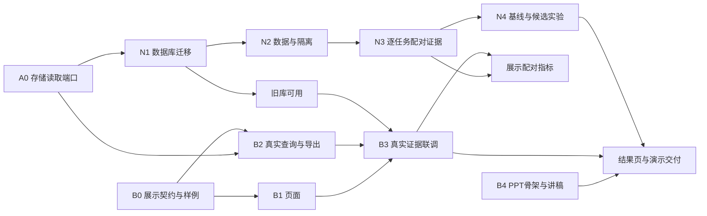

# 下一步总览：供项目负责人统筹与验收

本文供分配任务的项目负责人查看，不是让每位组员及其 Codex 执行全部任务的指令。组员的执行身份、范围、接口和验收要求以各自任务书为准；不能把当前聊天用户自动认定为项目负责人。

## 1. 发给两位组员的固定入口

| 接收人 | 发给他的文档 | 完整责任 | 从哪里开始 |
| --- | --- | --- | --- |
| 执行者 A：核心开发 | [任务书 A](TASK_CORE.md) | 近期 R1（N4 真实收尾）、R2（评价与数据）；R3–R7 为后续排期 | 先 R1，缺模型配置时继续 R2 本地工作 |
| 执行者 B：展示开发 | [任务书 B](TASK_PRESENTATION.md) + [前端规范](FRONTEND_SPEC.md) + [PPT 设计](PRESENTATION_PLAN.md) | B0–B4：展示契约、只读 API、导出、前端、截图、PPT 与讲稿初稿 | B0，并行准备 B1 与 B4 |
| 项目负责人 | 本文 | 分配任务、接口审查、实验规则与预算确认、交付验收、最终汇报 | 检查双方首批接口和样例 |

两份任务书都含可直接复制给 Codex 的开工指令。A/B 是固定任务代号，不是个人姓名。只执行被分配的任务书；阅读另一份了解依赖不等于接管另一侧任务。

**负责人不需要同时开发 N2、N4。** N2 的题目、清单、校验与复核材料，N4 的协议草案、配置、脚本、执行与报告，均由 A 完成。B 自己完成展示接口挂载和讲稿。负责人检查可审查的成果，不承担第三条并行开发线。

## 2. 本轮范围与现状

本轮是近期迭代，不是完整第一版的全部开发任务。产品范围和 P0–P5 验收继续以 [PROJECT](PROJECT.md)、[ROADMAP](ROADMAP.md) 为准，架构不重新设计。

当前后端已交付 A0 读取端口、N1 迁移、N2 隔离与执行时来源、N3 配对/Gate，以及三项审查修复。N4 基线与有限对照脚本已实现；真实有限对照仍缺模型配置，不能标记完成。B 可接入现有端口继续前端，不必等待新实验。已有历史 Gate Reject 不证明充分样本的晋级收益。

以下 A0/N1–N3 依赖已在后端代码中交付；图表保留用于 B 联调追踪，不能据此重新执行已完成开发。

## 3. 耦合关系与等待期间的工作

A0 → N1 是同一执行者的交付次序，不是迁移算法必须依赖查询功能。

| 交接点 | 提供者与具体产物 | 消费者 | 等待时继续做什么 |
| --- | --- | --- | --- |
| 首批契约 | B 提供展示字段和 fixture；A 提供 A0 端口签名、分页/错误规则、测试和 main 提交号 | 双方核对一致性 | B 开发 fixture 适配、页面和 PPT；A 实现存储端口 |
| A0 完成 | A 提供只读列表和封存记录读取 | B2 接真实 API | B 先完成 DTO、路由测试与样例；不自行写存储 SQL |
| N1 完成 | A 提供升级命令、备份与恢复说明 | B3 读取旧数据库 | 新临时库或脱敏历史 JSON 可先联调；不清空旧库 |
| N3 完成 | A 提供配对字段、汇总口径和兼容说明 | B 扩指标页 | 旧证据缺字段显示未知，不由前端推算 |
| N4 完成 | A 提供脱敏报告、配置和证据引用 | B 更新结果图、PPT | 先用明确标注日期和限制的历史证据，缺新结果留空 |

A 主维护领域、演进、存储和实验；B 主维护展示模块、前端、只读 router，以及 `api.py` 的最小挂载改动。详细边界见各任务书。共享文档只更新各自实现相关段落；同一文件有重叠时先约定改动范围。接口变更由提供者说明、消费者适配并测试，不能把最后补代码的责任默认留给负责人。

## 4. 负责人什么时候检查

| 时点 | 执行者必须先准备好 | 负责人检查事项 |
| --- | --- | --- |
| A0/B0 首次交接 | 接口、样例、错误与缺失值约定 | 两侧理解是否一致，是否泄露敏感配置 |
| 每项代码交付 | 实现、测试、使用说明、差异与限制 | 是否符合冻结架构和任务书，是否可以验收进入 main |
| N2 数据交付 | 分区清单、题目、摘要、重复检查及复核材料 | 抽查题目质量、分区隔离与覆盖；不亲自制作数据 |
| N4 基线执行前 | A 提交数据版本、命令、模型配置、预算及请求上限 | 确认实验口径和资源授权 |
| 基线后、候选比较前 | A 根据基线提出版本化 Monitor/Gate 规则与比较协议 | 审查并冻结规则；不能看候选结果后降门槛 |
| 实验与展示交付后 | A 提交报告，B 提交页面、PPT、讲稿及来源清单 | 核对结果、限制、可追溯性，完成演练 |

普通代码可以在交付时集中检查；**真实实验不宜只在结束后看一遍**，数据、预算和规则应在对应运行前确认。已经明确授权的相同范围无需重复确认；需要新增决定时，A 应交付具体方案供确认，同时继续本侧不受阻工作。

## 5. 验收里程碑与 main 交付

- [ ] M0：A0/B0 契约一致，读取端口通过测试；B 的样例与 PPT 骨架可查看。
- [ ] M1：A 完成 N1/N2；B 完成 B1/B2，页面可读取临时库，开发样例标签清楚。
- [ ] M2：A 完成 N3；B 完成 B3，真实 Run、事件与 Gate 证据可追踪，缺失项如实展示。
- [ ] M3：A 完成 N4 报告；B 完成 B4 和结果更新，负责人验收并演练。全部 Reject 仍可作为诚实的实验结果。

团队统一从 **main** 阅读和开始工作。功能改动按任务隔离并提交 PR；负责人验收后合入 main，再把 main 提交号交给依赖方。未验收分支不是已完成交付，组员不必追踪多条历史分支。进度复选框由执行者在各自任务书维护，本文里程碑由负责人验收后确认。

每项交付附文件、接口、测试结果、使用方式和未完成项。按 AGENTS 执行 uv sync、pytest、ruff、已声明的 Pyright；前端另附实际配置的检查命令。工具未运行不得声称通过，凭据和运行数据库不入 Git。

## 6. 后端下一轮

执行细节只维护 [TASK_CORE](TASK_CORE.md)：R1 收尾真实 N4；R2 完善不可行任务评价、扩独立数据并准备正式实验。缺模型配置不阻塞 R2 的本地工作。R3 崩溃恢复与预算、R4 Tool/Skill、R5 贡献消融、R6 自动治理、R7 三类任务与完整对照是后续排期，当前不自动全部启动。

你的下一次检查重点：R1 的预检/真实报告、R2 的评价契约与数据质量。自动演进、充分样本收益和完整项目验收仍按 ROADMAP；有限研究对照跑完不等于这些目标已完成。
