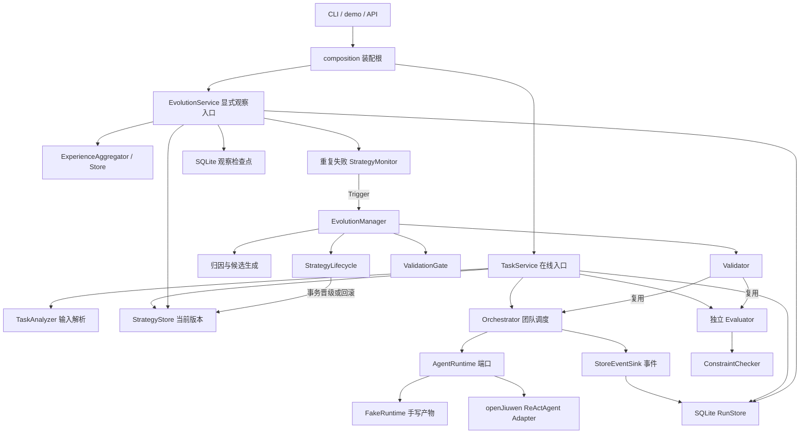
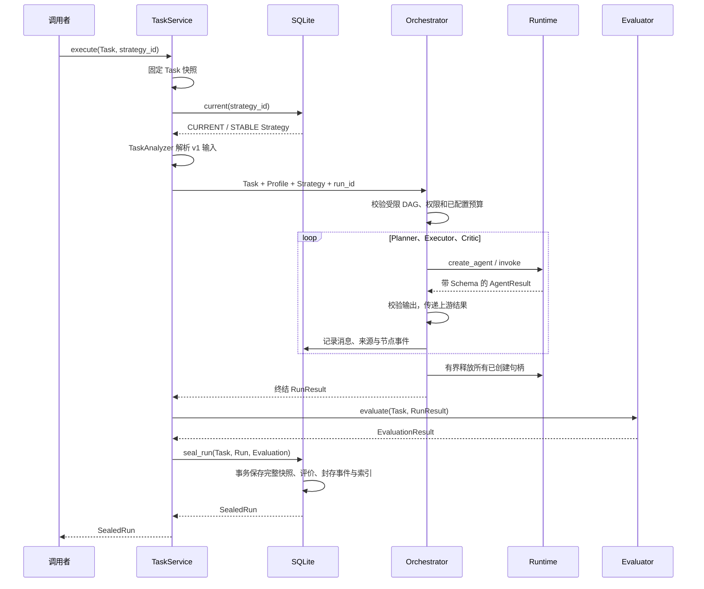

# EvoTeam 模块关系与系统运行指南

本文面向第一次阅读仓库的贡献者：先运行一个例子，再沿调用链读代码。产品边界以 [PROJECT](PROJECT.md) 为准，六层架构和治理规则以 [ARCHITECTURE](ARCHITECTURE.md) 为准，环境及完整文件索引见 [DEVELOPMENT](../DEVELOPMENT.md)。本文负责解释实际代码怎样连接，不维护另一套架构。

## 1. 当前能运行到哪里

| 路径 | 当前状态 |
| --- | --- |
| 项目规划输入、输出、规则检查 | 已实现 v1 契约和确定性正反例 |
| Planner → Executor → Critic | 初始 v0；已支持可选 Verifier 分支、结构化多上游和一次有界返工 |
| 独立评价、SQLite 封存和读取 | 已实现，成功、失败、超时、取消均留档 |
| 无模型演示 | 可运行；Fake Runtime 只返回手写产物，其他组件执行真实代码 |
| 真实 openJiuwen Adapter | 已实现 ReActAgent 调用；真实 SDK 对接本地 HTTP 的集成测试通过，另保留组员提交的外部服务回归记录 |
| Experience / Monitor | 已实现重复错误聚合、成功反例、重复失败 Trigger、冷却及检查点持久化；其余信号未启用 |
| 离线演进 | 已实现 Prompt/新增 Verifier 多候选、完整产物落库、配对验证、选择、Gate 和版本治理 |
| API / 前端 | 已有本地 health/init/run/observe/evolve API；前端与鉴权尚未实现 |

受限 Prompt/Verifier 演进流程可运行；Fake Runtime 晋级测试与少量外部调用不能证明稳定的演进收益。

## 2. 五分钟运行示例

在仓库根目录执行：

```bash
uv sync
uv run python -m evoteam roles
uv run python -m evoteam v0 --model-id preview --model-version draft
uv run python -m evoteam demo --database /tmp/evoteam-demo.sqlite3
```

`demo` 的数据库路径必须不存在；再次运行请使用另一个新文件名。命令使用 [task.json](../examples/project_planning/task.json) 和手写的 [plan.json](../examples/project_planning/plan.json)，打印 SealedRun JSON，在线证据写入 `strategies`、`events`、`runs`。当前还建立 `model_configs`（非敏感模型绑定）、`experiences`（经验）和 `monitor_states`（观察检查点）三张表，以及 strategy_counters、attributions、mutation_proposals、validations、evolutions 和 evolution_claims，分别保存版本号、归因、提案、验证、治理结果和演进消费登记。不需要模型密钥。

示例安排 Alice 在 `[0,2)` 小时做设计，在 `[2,6)` 小时实现，费率为每小时 100 分，人工费用共 600 分，未超过 800 分预算。相邻区间不重叠。这里的参数只用于演示，不是正式模型预算或实验校准结果。

Fake Runtime 的 Token 为 0，因为没有模型调用。示例成功只说明给定产物经过调度和程序检查，不能用于证明模型质量、成本优势或演进收益。演示使用独立的 `demo-project-planning` Strategy，首次登记为 CURRENT 是演示初始化，不是 Gate 晋级。

读取封存记录的代码形状如下；把 run_id 替换为命令实际返回值，在异步函数中调用：

```python
storage = SQLiteStorage("sqlite:////tmp/evoteam-demo.sqlite3")
ports = await storage.open()
try:
    snapshot = await ports.runs.read_snapshot(run_id)
    events = await ports.runs.events_for_run(run_id)
    # snapshot.task：本次输入；snapshot.strategy：完整配置；snapshot.run：产物与实例。
finally:
    await storage.close()
```

`SQLiteStorage` 来自 `evoteam.storage.sqlite`。数据库只在显式 `initialize()` 时建表；读取既有数据库使用 `open()`。`snapshot_ref` 是数据库内引用，不是外部文件地址。

### 配置真实模型并运行

参考 [.env.example](../.env.example) 创建或补齐本地 `.env`，填写：模型引用 ID/版本、服务端模型名称、兼容 Chat Completions 的 API Base、独立密钥、请求超时、最大输出 Token、temperature 和 top_p。当前只接 OpenAI 兼容协议，要求 JSON object 输出；配置示例目前填写了组员使用的服务与模型标识，须按实际服务核对；不支持时不静默降级。

检查 [strategy.json](../examples/project_planning/strategy.json)：模型引用必须与 `.env` 对应，预算必须明确。示例中的总 Token、总超时和单节点超时只用于启动配置，不代表校准结论。初始 CURRENT 表示显式登记第一条基线，不代表演进候选通过 Gate。

```bash
# 只登记配置，不调用模型；数据库文件必须不存在。
uv run python -m evoteam init --database ./evoteam.db --strategy examples/project_planning/strategy.json

# 真正调用模型；重复执行会新增 Run，失败也留档。
uv run python -m evoteam run --database ./evoteam.db --strategy-id project-planning --task examples/project_planning/task.json

# 显式观察，不调用模型、不生成候选。该 Policy 仅为示例，正式实验前须校准并登记版本。
uv run python -m evoteam observe --database ./evoteam.db --strategy-id project-planning --task-scope project_planning --policy examples/monitor_policy.example.json

# 显式演进；只有已有 Trigger 时才会运行 Current/Candidate 模型验证并可能切换版本。
uv run python -m evoteam evolve --database ./evoteam.db --strategy-id project-planning --task-scope project_planning --policy examples/monitor_policy.example.json --validation-plan examples/validation_plan.example.json --gate-policy examples/gate_policy.example.json
```

`run` 打印 SealedRun；评价通过返回退出码 0，执行/评价未通过返回 1，输入配置错误返回 2。查看具体问题使用返回的 evaluation.issues 和持久化 Trace。密钥不保存到数据库；base URL 禁止携带用户名、密码和查询参数。同一模型版本的服务地址、模型名或采样配置变化会被拒绝，密钥可以轮换。

旧版无模型演示数据库不会自动迁移或变成真实模型历史库。真实联调使用上述新数据库；后续数据库版本升级需显式迁移。`run` 的 SDK 控制台日志发送到 stderr，stdout 只保留结果 JSON。SDK 运行日志在 `logs/`，已排除 Git，可能包含任务内容；业务证据仍以 SQLite 为准。

默认 `uv run pytest` 只调用本地测试 HTTP 服务。有效 `.env` 和样例策略确认后，可显式运行真实模型冒烟：

```bash
EVOTEAM_RUN_LIVE_TEST=1 uv run pytest tests/test_live_provider.py -q
```

冒烟测试使用临时数据库，不能代替真实基线数据集；积累实验历史使用 `run` 和固定数据分区。

## 3. 模块关系



图中路径均已有首版实现；当前候选只覆盖登记 Prompt 与新增唯一 Verifier。六层是概念职责划分，并不对应六个服务。

| 模块 | 是什么、有什么用 | 从哪里读 |
| --- | --- | --- |
| domain | 可序列化的共同语言；区分稳定配置、运行实例与历史证据 | [planning.py](../evoteam/domain/planning.py)、[strategy.py](../evoteam/domain/strategy.py)、[run.py](../evoteam/domain/run.py) |
| composition | 连接依赖；只创建对象，不连接数据库或启动任务 | [composition.py](../evoteam/composition.py) |
| application | 决定模块调用顺序；分开在线任务、历史观察和离线派发 | [application.py](../evoteam/application.py) |
| orchestration | 按固定 Strategy 创建实例、传递消息、控制预算和终止 | [orchestrator.py](../evoteam/orchestration/orchestrator.py) |
| runtime | 把框架调用隔离在端口后面；仅 Adapter 能依赖 openJiuwen | [protocol.py](../evoteam/runtime/protocol.py)、[fake.py](../evoteam/runtime/fake.py) |
| evaluation / tools | Team 外独立验收；确定性规则也可在未来登记为工具 | [evaluator.py](../evoteam/evaluation/evaluator.py)、[constraint_checker.py](../evoteam/tools/constraint_checker.py) |
| storage | 保存事件、快照、模型绑定、经验与检查点；提供历史查询 | [sqlite.py](../evoteam/storage/sqlite.py) |
| experience / monitoring | 从多次兼容 Run 中提炼经验、判断是否出现长期异常 | [aggregator.py](../evoteam/experience/aggregator.py)、[strategy_monitor.py](../evoteam/monitoring/strategy_monitor.py) |
| evolution | Trigger 后组织归因、候选、对照验证和版本治理 | [manager.py](../evoteam/evolution/manager.py) |

## 4. 一次任务怎样运行



实际代码先固定 Task，再读取 Current，然后执行 TaskAnalyzer。一次运行保持同一份输入和 Strategy；调用者后来修改原 Task 不影响本次评价和封存。

- **Planner** 输出 `planning-analysis@1`，说明当前任务和约束。
- **Executor** 接收原 Task 与 Planner 结构化输出，生成 `project-plan@1`。
- **Critic** 接收原 Task 与 Executor 产物，生成 `planning-review@1`。它不覆盖 Executor 计划，也不能替代独立评价。
- **Evaluator** 在 Run 结束后寻找唯一计划，重新执行规则检查。`success` 表示执行完成且程序检查无错误；`quality` 保持未知，未引入语义质量评分权重。

节点输入使用 `planning-agent-input@1` 信封，包含原 Task 和直属上游输出。多上游时按 node_id 分组，`source_event_ids` 指向所有上游完成事件。Agent 不直接互调，Planner 不自动检索历史经验。Strategy 可把 retry_limit 设为 1：Critic 不通过时，Executor 接收 Planner 输出与结构化 Critic 反馈，随后 Verifier/Critic 最多再执行一次。

## 5. 项目规划 v1 数据契约

权威字段定义位于 [planning.py](../evoteam/domain/planning.py)，输入引用为 `project-planning-input@1`。以后变更单位或约束含义时应登记新版本，避免历史成绩混用。

| 内容 | 当前含义 |
| --- | --- |
| 时间 | 从项目起点计的非负整数小时；区间为 `[start_hour, end_hour)`；暂不建模日期、节假日或时区 |
| 人员 | 每人一个可用区间、技能集合和整数小时费率；同一时间只做一个工作项 |
| 工作项 | 输入定义的 work_id 必须恰好排期一次；工期固定、不可拆分，每项一名负责人；本版不自动拆成新 ID |
| 依赖 | 输入 DAG；前置项结束后才能开始；未知引用、重复 ID 与循环在运行前拒绝 |
| 费用 | 同一种 currency 下，以最小货币单位整数存储；仅计算排期工时乘人工费率，尚无材料费、汇率或加班规则 |
| 期限 | 同时检查项目总期限、人员可用时间和输入里程碑期限 |
| 里程碑 | 输出必须覆盖输入里程碑；完成时刻等于关联工作项最晚结束时刻 |
| 交付内容 | schedule、milestones、risks、adjustments、validation_notes 必须存在；风险/调整可为空列表，校验依据至少一条 |

输入格式非法直接拒绝；格式合法但无法满足的任务仍可执行并留失败结果。程序检查只验证文本字段存在，不判断风险描述是否充分，也不证明所有可行计划已被找到。

`ConstraintChecker` 返回错误代码和 `work:`、`person:`、`milestone:` 或 JSON 路径证据；不只返回真假。人员冲突与依赖错误可以同时出现，错误数量不等同于满足率分母。

## 6. 失败、预算和封存

已覆盖 Runtime 异常、非法输出、超时、调用者取消、Token 超限和数据库事务失败。

- 执行前要求显式 Token/超时预算；当前只支持三节点链或含唯一 Verifier 的四节点受限 DAG、零 Tool、最多一次业务返工、零 Replan。未知 Prompt 引用及不支持的图直接拒绝。
- Adapter 向 SDK 传递 `min(单次最大输出 Token, 剩余总 Token)`，并关闭 HTTP 重试、工具和额外迭代；响应返回后按供应商报告的输入+输出用量检查总预算。当前未按服务端 tokenizer 预计算输入 Token，因此总预算是事后检测并阻止后续节点，不能保证本次请求的输入费用不超额，也不是总成本硬上限。
- 已完成产物在后续失败时保留并独立检查；供应商缺失或仅提供部分用量时保持未知，不能采用 SDK 填充的零值。
- 错误实例或 Schema 的返回值保存在不可信失败 Trace，不作为可信计划评分。
- 取消转换为 CANCELLED 结果并封存；清理任务受保护且每个 close 有超时。在线入口以结果返回取消状态；Validator 封存该 Run 后重新抛出 CancelledError，终止后续验证任务和候选。清理超时/异常会记录失败原因，Adapter 会释放对应的 SDK checkpoint 和 context；HTTP 客户端使用非共享模式，在 SDK 调用 finally 中关闭。
- 封存事务同时写评价事件、封存事件、快照和索引；写入失败整体回滚。封存后不能追加事件或覆盖结果。
- Strategy 只能首次登记，唯一约束禁止覆盖同版本或设置第二个 Current；正式生命周期通过原子事务切换，不能通过 save 冒充晋级。

数据库使用同步短事务，当前目标是单机演示；并发服务、崩溃恢复、Schema 升级迁移、模型调用期间进程退出等尚未完成。读取记录可重建历史产物，不代表重新调用随机模型会得到完全相同文本。

## 7. 历史观察和演进路径

```text
显式 inspect
  → 固定 Current，读取同版本、同范围、同评价协议的线上历史
  → Aggregator 归纳同类重复错误，保存支持 Run 与成功反例
  → Monitor 按显式 Policy 判断重复失败，保存观察检查点

显式 evolve_if_needed
  → 上述观察，无 Trigger 则返回 None
  → 再次确认 Current 没变
  → 同一份证据交给 Manager
  → 归因 → 受约束候选 → Validator 对照验证 → Gate → 生命周期操作
```

正常在线任务不会自动调用演进。Validation Run 不进入线上观察窗口；Validator 复用同一个 Orchestrator 和 Evaluator，并分别封存 Current/Candidate。何时观察与数值阈值仍需真实基线校准；当前没有后台调度器。检查点按策略、范围、评价版本和 Policy 版本隔离。完全相同窗口返回同一个已有结果与 Trigger ID；不会重新消耗冷却计数。新窗口按此前未观察过的 Run 计数冷却，进程重启后继续使用检查点；同时观察发生竞争时通过 revision 检查拒绝陈旧写入。

当前只启用 `repeated_failure`。同一个 Run 多条同码错误只算一次；优先选重复次数最多的错误码，相同时按名称固定排序。没有明确成功指标的 Run 不作成功反例，置信度和因果归因保持未知。max_candidates 已约束本轮候选数量；Policy 中其他信号阈值与 stable_window_count 暂为后续规则保留，不能据此声称漂移、成本、贡献判断或自动 STABLE 已实现。在线证据增长后的模式使用独立内容 ID，重复保存相同内容幂等。

Manager 在调用归因与模型之前原子登记 Trigger 消费。已完成请求返回既有记录；同一 Strategy 执行中的竞争请求拒绝，不能通过改变 Gate 或 ValidationPlan 重放同一 Trigger。取消会停止验证并保存终止原因；发生父版本竞争时，只拒绝仍未上线的候选，不覆盖新 Current。进程硬退出遗留的 claim 暂不自动恢复，须人工核对。

Gate 要求改进归因引用本次验证、配对 Run 身份独立、受限成本指标已知，并达到显式 minimum_paired_runs。未登记样本门槛时旧配置仍可读取，但不能 PASS。当前 Gate 示例要求至少两对，打包 Validation 示例仅一个任务一次执行，因而只用于流程演示，不具备晋级条件。正式样本量必须基线校准后以新 Policy 版本预注册；两对本身不代表显著性。

Validator 在调用模型前检查共同节点的模型、Runtime/授权能力及总调度预算一致。seeds 尚未实际下发至 Runtime，结果明确记录 seed_not_applied；聚合指标仍不包含逐任务负迁移或置信区间，记录 aggregate_metrics_only。History / Validation 的 RunPurpose 隔离已经实现，任务内容独立性登记和去重仍待完成。

初版检查点保存已观察 Run ID 列表，适合当前受控单机实验；大规模历史需要更紧凑的游标和数据保留方案。

## 8. 新贡献者从哪里继续

1. 阅读本指南，运行 demo 和 `uv run pytest`。
2. 看 `composition.py` 与 `application.py`，再沿对应模块进入实现；完整文件职责索引在 DEVELOPMENT。
3. 配置外部模型，运行固定项目规划数据集，检查真实产物、用量、超时和失败分布；SDK 本地联调已通过，不等同于特定供应商验收。
4. 校准真实基线的 Policy，扩展带基线的漂移/成本信号及受控 Tool；现有重复失败观察可复用。
5. 在现有 Prompt 闭环上补 Contribution 消融、Tool Policy 与结构 Mutation。不要扩大 Role Pool、重写框架或添加新的 Strategy Family。

相关行为测试：[项目规划规则](../tests/test_planning.py)、[在线闭环与故障](../tests/test_online.py)、[应用调度边界](../tests/test_application.py)、[Prompt 演进闭环](../tests/test_evolution.py)。SDK 协议联调见 [test_openjiuwen.py](../tests/test_openjiuwen.py)，完整接入与慢响应故障见 [test_runtime_entry.py](../tests/test_runtime_entry.py)，观察与持久化见 [test_monitoring.py](../tests/test_monitoring.py)。测试中的脚本响应与故障注入都不是实验结果。
