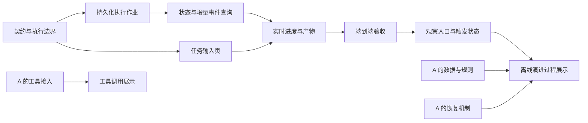

# 网页任务执行与展示开发计划

**目标：** 在已有证据工作台之外，交付“输入任务 → 真实执行进度 → 结果 → 完整证据”的用户入口。

**实现依据：** [FRONTEND_SPEC](FRONTEND_SPEC.md) 定页面与交互；本文件定任务顺序、接口、文件边界与验收。冻结领域与演进规则仍以 AGENTS、ARCHITECTURE、EXPERIMENTS、DECISIONS 为准。

**执行者：** 当前网页功能由项目负责人及其 Codex 接手。B 只是历史展示任务代号，不再指原组员；不要把负责人重新安排为仅验收、不写前端。A 继续执行 [TASK_CORE](TASK_CORE.md) 的 R1/R2，本计划不要求 A 同时实现下面全部任务。

**技术与边界：** 复用 React/TypeScript/Vite、Tailwind v4、Radix 组件、React Flow/Recharts、FastAPI、SQLite 与现有 TaskService。首次用有界轮询传递实时状态；不引入 Redis、Celery、微服务或新的 Agent 框架。页面不重新计算评价或 Gate。

> 给下一次 Codex 的指令：先核对 main，阅读本文件和 FRONTEND_SPEC，按 F0 → F1 → F2 → F3 → F4 → F5 实现网页任务闭环。F3 的表单可在 F0 契约确定后独立开发，但真实提交必须等待 F1/F2。逐项先写失败测试、实现、验证再提交，不重建已有工作台。只执行首轮 F0–F5；E1/E2、T1、D1、P1 是后续排期，不顺便启动模型实验。开发验证使用独立临时库与 Fake Runtime；真实任务需要服务端模型配置和明确的运行预算。执行计划时使用 executing-plans 按任务推进，无需另起多份日期计划。

## 1. 当前实际交付与未实现内容

| 能力 | 状态与边界 |
| --- | --- |
| B0 展示契约、样例 | 已有 Zod 校验和展示信封；fixture 始终标为开发样例 |
| B1 四类证据页 | 已有运行详情、拓扑/实例/历史回放、演进证据、版本/配置差异；桌面/手机截图已交付 |
| B2 只读 API | 已有六类 GET、Run 脱敏导出，SQLite mode=ro；读取不启动模型 |
| CLI 与 POST 执行 | 已有 `run`、`POST /v1/runs`；当前 POST 等待执行完成才返回 SealedRun |
| 网页提交与实时执行 | 尚未实现；当前页面不能提交任务，600ms 回放不是真实时进度 |
| 运行中查询 | Trace 已逐步写入，但现有事件 GET 先检查 SealedRun，不能直接用于未封存 Run |
| Tool/Skill | 当前 Agent 执行路径未开放；约束检查器用于评价，不是 Agent 已调用工具的证据 |
| 真实实验展示 | HTTP 联调用的是独立无模型演示库；完整实测材料仍需来源核对，不把 fixture 当实测 |
| 后续导出与 PPT | Evolution 闭包下载、历史离线包、PPT 成稿尚未交付 |

已存在的查询：`GET /v1/runs`、`/v1/runs/{run_id}`、`/v1/runs/{run_id}/events`、`/v1/strategies/{strategy_id}/versions`、`/v1/evolutions`、`/v1/evolutions/{evolution_id}`，另有 `/v1/runs/{run_id}/export`。返回的是脱敏展示投影，不承诺完整原始 Domain JSON。现有接口兼容性必须保留。

## 2. 分工与依赖

F0–F2 包含用户入口必需的应用/存储改动，由当前网页任务执行者完成；不是只做一个输入框，再把后端集成留给别人。改动 `application.py`、`storage/`、`api.py` 前告知 A 文件范围，避免与 R2/R3 并行编辑同一段代码。A 不重复实现网页执行作业；R3 复用其恢复契约，继续处理模型请求不确定性及演进 claim 恢复。

F3 可在 F0 后基于相同 DTO 开发明确标记的样例；F4 联调等待 F1/F2。E2 等待可用数据/规则和可靠的演进执行边界，T1 等待 R4。工具或演进未就绪不阻塞 F0–F5。

## 3. 首轮契约：F0–F5 的共同依据

以下是待实施约定，不是现有端点。F0 固定 Python 与 TypeScript Schema，后续任务消费同一契约。

### 接口

| 待新增接口 | 输入与返回 | 规则 |
| --- | --- | --- |
| `POST /v1/executions` | `{request_id, task: Task, strategy_id}` → 202 + ExecutionView | request_id 是前端生成并保持的 UUID；不接收模型密钥、任意数据库路径、候选版本或前端 Gate 参数 |
| `GET /v1/executions/{execution_id}` | ExecutionView | 有作业但未封存时仍返回状态；不存在返回 404 |
| `GET /v1/executions/{execution_id}/events?after_sequence=-1&limit=100` | `{items: TraceEventView[], next_after_sequence, terminal}` | sequence 严格递增，返回大于游标的事件；limit 范围 1–100，未产生事件返回空列表 |
| `POST /v1/executions/{execution_id}/cancel` | ExecutionView | 显式取消请求；重复取消幂等，不能提前伪装为已经取消 |

ExecutionView 字段：`execution_id`、`run_id`、`strategy_id`、`status`、`phase`、`created_at`、`started_at`、`finished_at`、`strategy_ref`、`last_sequence`、`sealed_run_id`、`error_code`、`safe_message`、`cancel_requested`。可空字段分别为三项尚未发生的时间（created_at 必有）、strategy_ref、sealed_run_id、错误信息；无事件时 last_sequence=-1。GET 与 POST 都保留 schema_version/source_kind/captured_at/code_commit/missing_refs 的展示信封。

作业状态固定为 `accepted / running / completed / failed / timed_out / cancelled / interrupted`；它不同于 Domain RunStatus，尤其 interrupted 不得伪造成一个已封存 Run。phase 为 `accepted / executing / evaluating / sealing / terminal`，只根据后端真实阶段变更显示。completed 表示流程完成并封存，评价 success=false 仍可能是 completed；必须分别展示运行状态与评价结果。

### 执行规则

1. 接收前验证 Task/PlanningInput、服务端模型配置、数据库布局、当前服务策略与已登记模型绑定；非法内容 422，未就绪 503，未知策略 404。同一个 request_id 与相同规范请求内容返回原作业；不同内容复用该 ID 返回 409。
2. 原子登记 request_id、请求摘要、Task 输入、execution_id、预分配 run_id 后才返回 202。单机单 worker 首轮最多一个网页作业运行，超额请求返回 409，不建立无限队列。幂等重试先查已有作业，不受“当前忙碌”影响。
3. 后台执行复用 TaskService、Orchestrator、Evaluator 和封存事务。内部传入预分配 run_id，保留 CLI/原 POST 的默认行为；一次 Run 的实际策略在开始时固定。预检显示的版本可能在提交前后变化，界面以运行开始时的 strategy_ref 为准。
4. 启动预检与原 POST/CLI 的初始化约束一致；模型登记、Prompt 引用、执行上限不允许前端放宽。一次执行的终态在封存成功后才确认 completed/failed/timed_out/cancelled，基础设施故障单独保存安全错误及缺失封存提示。
5. 页面轮询超时或断网不是执行失败，不重新 POST。用户可返回已有 execution_id 查询；若创建响应丢失，可用原 request_id 和相同内容重试以取得原作业。明确点击“再次执行”才产生新 request_id。
6. 用户取消触发现有协作取消和终态留档路径；直到后台确认才显示 cancelled。已经完成返回原终态。浏览器离开不自动取消；服务正常关闭尽量清理并留档。
7. 进程硬退出后，启动恢复读取持久化作业：已有对应 SealedRun 的作业根据封存事实修复终态，其余遗留 accepted/running 标 interrupted，保留事件与错误。禁止自动重放不确定的付费调用或补造 SealedRun。
8. 执行进度数据与 SealedRun 分离；不能修改封存模型来容纳“边跑边写”的状态。恢复不会清理用户历史库。新增表走显式备份迁移，GET 不隐式初始化或迁移。
9. 本轮网页作业服务仅支持一个应用进程。必须在启动说明中标明单 worker；原 CLI、原同步 POST 和独立实验脚本不被网页并发锁覆盖，运行演示时不得向同一服务库并发启动这些写入口。后续统一并发治理属于 R3，不宣称首轮已有全局队列。
10. 普通自由输入 Task 可执行，但不自动纳入 History；保持既有 DatasetSource 规则。只有已登记、分区合规的证据能参与演进，前端不能通过填写 manifest_ref 伪造来源。

### 实时读取与展示数据

首次使用运行期间每 1 秒读取状态/增量事件；页面不可见时暂停轮询，返回可见后立即补读。每路查询最多一个在途请求，读失败退避为 2/4/8 秒，上限 8 秒；清理离开页面的请求。终态后读完剩余事件，再停止轮询并读取已有 Run 详情。终态并不意味着事件分页已经读完。

读取已持久化事件，按 `(run_id, sequence)` 排序去重；作业 ID 必须映射到自己的 run_id。last_sequence/next_after_sequence 指真实事件游标，不能使用前端计数充当服务端游标。打开/重连/翻页均不调用 Runtime。

TraceEventView 延续已有事件身份与因果字段；按事件类型白名单增加可展示的配置、节点状态及已完成产物，不返回 SDK 日志、原始 context、密钥或隐藏推理。节点调用未完成时显示“执行中”；返回后显示结构化产物。现有 SDK 没有文字逐 token 流，不用打字动画制造流式输出。未来 SSE 可替换传输方式，但不能改变事件语义，首轮不同时开发两套传输。

## F0：固定契约与测试样例

**文件：** 新增 `evoteam/execution/models.py`、`frontend/src/data/executions.ts`；维护 `evoteam/presentation/models.py`；新增 `tests/test_execution_contracts.py`、`frontend/src/data/executions.test.ts`。

**产物：** 上述 SubmitExecution、ExecutionView、增量事件信封的 Pydantic/Zod Schema；成功、评价失败、超时、取消、中断、缺封存与断线恢复样例。Domain Task/PlanningInput 复用既有模型。

- [ ] 先写状态与输入反例：缺必需约束、非法依赖、错误状态、未知用量、completed 与 success=false 合法。
- [ ] 运行 `uv run pytest tests/test_execution_contracts.py`，确认接口尚未实现时失败；实现 Schema 后通过。
- [ ] 用相同 JSON 样例验证 Python/TypeScript 契约，执行 `npm --prefix frontend test -- src/data/executions.test.ts`。
- [ ] 将契约与本节字段核对后提交；后续任务不得自行改字段名或把 job status 当评价结果。

## F1：持久化作业与后台执行

**文件：** 新增 `evoteam/execution/service.py`、`evoteam/execution/store.py`、`evoteam/api_executions.py`；维护 `evoteam/api.py`（lifespan 与 router）、`application.py`（兼容的 run_id 注入）、`storage/sqlite.py` 和 `storage/migrations.py`；新增 `tests/test_execution_service.py`、`tests/test_execution_recovery.py`，扩展迁移测试。

**接口职责：** service 提供 `submit(request)`、`get(execution_id)`、`cancel(execution_id)`、`recover()`；store 提供原子幂等登记、状态转换、作业读取和遗留作业枚举。类型来自 F0。后台任务持有强引用，在应用关闭时管理取消与清理，不能依靠一个无持久化状态的 BackgroundTask 就宣称支持恢复。

- [ ] 用可阻塞 Fake Runtime 写失败测试：POST 在 Runtime 完成前返回 202；同一 request_id 重试只启动一次；不同请求复用 ID 被拒绝；忙碌返回 409。
- [ ] 先验证失败，再实现持久化、服务端预检、TaskService 调度和生命周期；不复制一套 Agent 执行器。
- [ ] 覆盖评价失败、超时、取消、请求断开、正常停机、硬退出恢复、封存已完成但作业未更新等情形；确认不会自动再次调用模型。
- [ ] 执行 `uv run pytest tests/test_execution_service.py tests/test_execution_recovery.py tests/test_migrations.py tests/test_api.py`。
- [ ] 记录新库/旧库迁移与恢复命令，提交可独立运行的作业服务；保留旧 POST / CLI 回归通过。

## F2：运行中的状态和增量事件

**文件：** 维护 `evoteam/api_executions.py`、`evoteam/execution/service.py`、`evoteam/presentation/projections.py`；按需为 `storage/protocol.py`、`storage/sqlite.py` 增加只读增量事件端口；新增 `tests/test_execution_events.py`。

**消费/输出：** 消费 F1 的 execution_id→run_id 映射和既有持久化 Trace；输出 F0 增量事件信封，不以 SealedRun 是否存在判断正在执行的作业是否存在。

- [ ] 先写未封存事件可读、未知作业 404、分页顺序、相同游标重读、跨作业隔离、完成后补读全部尾部事件的失败测试。
- [ ] 实现状态查询、事件投影和每页最多 100 条的查询；禁止一次拉取全部历史后在前端冒充服务端分页。
- [ ] 检查节点输出只在实际完成事件或安全产物引用可用后展示；未知用量和缺失输出保持未知。
- [ ] 执行 `uv run pytest tests/test_execution_events.py tests/test_api_queries.py`，验证读取不增加模型调用或写入历史证据。
- [ ] 提交接口、字段来源和缺失值说明，交给 F4 消费。

## F3：任务输入首页

**文件：** 新增 `frontend/src/pages/start-task.tsx`、`frontend/src/components/task/planning-form.tsx`；维护 `src/main.tsx`、`app/layout.tsx`、`data/executions.ts`、`styles/theme.css`；新增表单行为测试。

**消费/输出：** F0 Task 请求契约；目标文本、工作项、人员/技能、依赖、期限、预算构成 `project-planning-input@1`。第一版不增加 LLM 自然语言解析调用。

- [ ] 先写必填字段、添加/删除人员与工作项、依赖引用、整数小时/费用单位、加载样例和输入错误定位测试。
- [ ] 实现 `/start`；全部 F5 验收后才将 `/` 默认入口从 `/runs` 切到 `/start`。导航同时保留“开始任务”和“证据工作台”。
- [ ] “开始执行”是唯一任务写入口：校验后生成并保留 request_id；禁用连点；创建失败保留输入，网络结果不确定时沿用原 ID 重试。
- [ ] 模型/策略未准备好时解释配置问题；不向用户展示凭据输入框或允许任意 Candidate 服务任务。
- [ ] 执行 `npm --prefix frontend test -- src/components/task` 及 typecheck；等待 F1 时使用明确的 fixture，不把模拟提交展示成真实运行。

## F4：真实进度与结果

**文件：** 新增 `frontend/src/pages/execution.tsx`、`src/data/use-execution.ts`、`src/components/task/execution-progress.tsx`；复用已有产物表格、节点、状态和来源组件；新增 `src/data/use-execution.test.tsx`。

**消费/输出：** F1/F2 的执行状态和事件；`/executions/:executionId` 是可恢复深链接，完成后跳转对应 `/runs/:runId`，不能猜测最近一条 Run。

- [ ] 使用 fake timers 和模拟 API 先测试增量合并、去重、断网退避、隐藏页面暂停、终态尾页补读、取消请求和卸载清理。
- [ ] 按 FRONTEND_SPEC 的“左产物、右进度”布局展示 Planner/Executor/Critic、独立评价与封存；实际启用 Verifier 才显示它。
- [ ] 显示实际策略版本、执行时长、已提供的用量、已完成产物、错误和明确终态；无依据不显示完成百分比或预计费用。
- [ ] 用户取消显示“正在取消”，后端确认后才显示取消；普通刷新不发 POST，不取消后台任务；“再次执行”明确创建新任务。
- [ ] 完成后提供“查看完整证据”“新建任务”；状态与评价独立。工具区未接入时显示能力说明，不能把评价器当工具调用。
- [ ] 执行 `npm --prefix frontend test -- src/data/use-execution.test.tsx`，提交可联调的完整用户流程。

## F5：联调、无模型验收与使用说明

**文件：** 扩展 `frontend/e2e/serve_api.py`、`e2e/api.spec.ts`；新增 `e2e/execution.spec.ts`；维护 `frontend/README.md`、DEVELOPMENT、本文和 FRONTEND_SPEC。

- [ ] 用可控 Fake Runtime 和独立临时数据库完成“输入 → 202 → 真实后台阶段 → 封存 → 工作台”浏览器测试；不能只测预置前端定时器。
- [ ] 覆盖连点、创建响应丢失、刷新/回退、两个标签页、请求中断、失败、超时、取消、服务重启与缺封存；确认每个用户 request_id 最多创建一个 Run。
- [ ] 核对 1440px 与 390px，键盘可操作、抽屉焦点、reduced-motion、来源标记和错误提示；提交截图与说明。
- [ ] 执行 `uv sync`、`uv run pytest`、`uv run ruff check .`、`uv run ruff format --check .`、`uv run pyright`；执行前端 build/typecheck/lint/test/test:e2e。
- [ ] 写明 API 启动、单 worker、数据库准备、模型配置、网页执行和 CLI 备用命令；同时保留只读工作台入口。
- [ ] 单次真实模型验收另行使用已授权的配置与预算；未执行时明确标“无模型端到端已通过，真实模型验收未执行”，不阻塞提交已验证代码。

## 4. 后续任务，不纳入 F0–F5

| 编号 | 工作内容 | 前提与验收 |
| --- | --- | --- |
| E1 | 执行结束后提供独立“检查演进信号”入口，展示未检查/未触发/证据不足/已有 Trigger | 复用 observe，读取已登记的服务端 Policy；默认不自动生成候选，不把一次任务失败视为必然触发 |
| E2 | 显式启动离线演进，展示归因、候选、配对验证、Gate 与实际服务版本变更 | A 的合规 History/Validation、已确认规则/预算与 R3 恢复机制；演进有独立 execution_id 和调用上限，不能复用在线任务页面的模型预算；复用 Manager，不绕过 Gate |
| T1 | 展示真实 Tool 调用、参数摘要、结果、耗时及对产物的证据引用 | A 的 R4 登记能力和真实 Tool 事件；必须与 Evaluator 检查区别展示，结果不足不能推出“工具提升效果” |
| D1 | Evolution 脱敏引用闭包导出、历史离线包读取与真实素材核对 | 同一展示 DTO、白名单、来源清单、缺引用标记；不混用 fixture/历史/当前库，不依赖现场反复付费调用 |
| P1 | PPT 成稿、截图与讲稿 | 按 PRESENTATION_PLAN 的 14+4 页；先骨架后真实素材，缺证据留空，未实测晋级不填写虚构收益 |

E1/E2 的详细接口在轮到该任务时基于届时核心实现补入本文件。当前不能把这两项标记为已支持，也不能在 F0–F5 里顺便添加“每次任务自动演进”。工具接入、评价改革和演进算法仍由 TASK_CORE 排期，不复制到网页代码。

## 5. 交付状态

- [ ] F0 契约与共同样例
- [ ] F1 持久化后台执行与取消/中断边界
- [ ] F2 运行中状态与增量事件
- [ ] F3 任务输入首页
- [ ] F4 真实进度与结果
- [ ] F5 端到端验收与说明
- [ ] E1/E2 演进操作与进度
- [ ] T1 工具调用展示
- [ ] D1 完整实测素材与离线证据
- [ ] P1 PPT 成稿

本次提交只整理上述开发计划，保留已完成工作台；未实现任务保持未勾选。后续任务按现有分支/PR 流程验收后统一进入 main，团队以 main 为唯一阅读入口。
